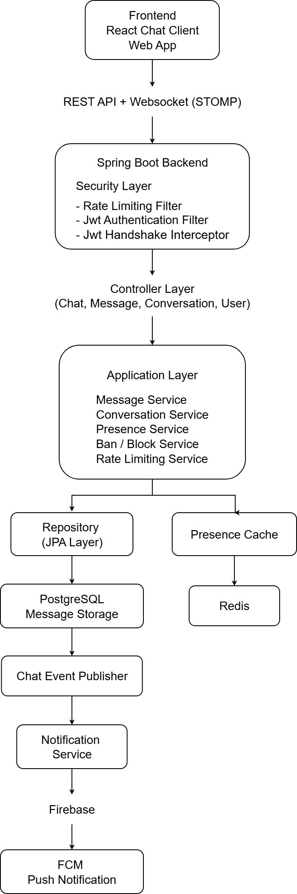

# Real-Time Messaging Platform

A full-stack real-time messaging platform built with Spring Boot, React, WebSocket/STOMP, PostgreSQL, Redis, and JWT Authentication.

The system supports real-time messaging, user presence tracking, distributed rate limiting, conversation management, file sharing, and push notifications. It is deployed using Render, Vercel, Neon PostgreSQL, and Redis Cloud.

### Live Demo

Frontend: [https://chat-messaging-app.vercel.app](https://realtime-messaging-platform-react.vercel.app/)

Backend API: [https://realtime-messaging-platform-springboot.onrender.com](https://realtime-messaging-platform-springboot.onrender.com)

### Key Features

* Real-time chat using WebSocket/STOMP
* JWT authentication and authorization
* Redis-based online presence tracking
* Distributed rate limiting using Bucket4j + Redis
* File uploads for profile pictures and chat attachments
* Push notifications using Firebase Cloud Messaging
* PostgreSQL persistence with Spring Data JPA
* Cloud deployment with Vercel, Render, Neon, and Redis Cloud


## Overview

This project is a backend system for a real-time chat application built using Spring Boot and WebSocket (STOMP).

The goal of this project is to design a chat backend that supports real-time messaging, conversation management, presence tracking, moderation features, and push notifications. 
Users can send and receive messages instantly through WebSocket connections. The system also tracks online presence using Redis and sends push notifications using Firebase Cloud Messaging (FCM).

## Screenshots

### Login Page


### Conversation Creation


### Chat Interface


## Problem Statement

Most basic chat applications only demonstrate simple message exchange between users. However, real-world messaging systems require much more than just sending messages.

A production-ready chat system needs to handle:

- real-time communication
- authentication and security
- online/offline presence tracking
- conversation management
- moderation features (block, ban)
- push notifications
- protection against abuse such as message flooding

This project was created to explore how these components can work together in a backend architecture using Spring Boot.

The goal was to design a system that resembles a simplified version of messaging platforms like WhatsApp or Discord from a backend perspective.

## Tech Stack

Backend:
- Java 17+
- Spring Boot
- Spring WebSocket (STOMP)
- Spring Security
- Spring Data JPA

Database:
- PostgreSQL

Caching / Realtime State:
- Redis

Authentication:
- JWT (JSON Web Token)

Push Notifications:
- Firebase Cloud Messaging (FCM)

Build Tool:
- Maven

## Features

The backend provides several core features commonly found in modern messaging systems.

### Real-Time Messaging

* Bidirectional communication using WebSocket/STOMP
* Supports private conversations between users
* Instant message delivery without polling

### Authentication & Security

* JWT-based authentication
* Secured WebSocket handshake authentication
* Distributed rate limiting to prevent message flooding

### Presence Tracking

* Online/offline user tracking using Redis
* Real-time presence updates for connected users

### File Sharing

* Profile picture uploads
* Chat attachment support for images and documents

### Notifications

* Firebase Cloud Messaging integration
* Offline users receive push notifications

### Moderation

* User blocking
* User banning
* Protection against unwanted interactions

### Rate Limiting
- protect the system from flooded messages
- applied through filters and interceptors

### Push Notifications
- Firebase Cloud Messaging integration
- send notifications when users are offline

### Read Receipts
- track whether messages were seen by participants or not

## System Architecture

The following diagram shows the high level architecture of the system and how different components interact.



The system follows a layered architecture:

Client Layer  
Handles communication through REST APIs and WebSocket connections.

Security Layer  
Responsible for authentication and request protection using JWT and rate limiting.

Controller Layer  
Handles incoming requests and routes them to application services.

Application Layer  
Contains the main business logic including messaging, presence tracking, moderation, and notifications.

Repository Layer  
Handles database interaction using Spring Data JPA.

Infrastructure  
- PostgreSQL for message storage
- Redis for presence tracking
- Firebase for push notifications

## Message Flow

1. A user sends a message through the WebSocket connection.
2. The request passes through the security layer (JWT + rate limiting).
3. The controller receives the message request.
4. MessageService processes and validate the message.
5. The message is stored in PostgreSQL through the repository layer.
6. ChatEventPublisher publishes the event.
7. The message is broadcast to other connected users.
8. If the recipient is offline, NotificationService sends a push notification through Firebase.

## Project Structure

The project follows a layered architecture structure.
src/main/java
```text
configuration  → application and framework configuration  
controller     → REST and WebSocket endpoints  
service        → business logic  
repository     → database access  
model          → entity models  
security       → authentication and security logic  
component      → event publishing and helpers  
exception      → global exception handling  
DTO            → request and response objects
```

## Technical Challenges Solved

### Distributed Rate Limiting

Implemented distributed rate limiting using Bucket4j and Redis to ensure limits remain consistent across multiple application instances.

### Presence Tracking

Designed a Redis-backed presence system to track user online/offline status in real time without repeatedly querying the database.

### WebSocket Authentication

Integrated JWT authentication into WebSocket handshakes to ensure only authenticated users can subscribe and publish messages.

## Deployment

Frontend:
- Vercel

Backend:
- Render

Database:
- Neon PostgreSQL

Cache:
- Redis Cloud

The application is deployed and accessible through public URLs for demonstration purposes.

## Running the Project

### Requirements

- Java 17+
- PostgreSQL
- Redis
- Firebase project for push notifications

### Steps

1. Clone the repository

git clone [https://github.com/thamizharasan-nemo/RealTimeMessagingApplication-SpringBoot]

2. Configure application.properties

Update database, Redis, and Firebase configuration.

3. Run the application

./mvnw spring-boot:run

or

Run the main Spring Boot application class from your IDE.


## Possible Improvements

Some features that could be added in the future:

- message delivery status (sent / delivered)
- typing indicators
- message search
- message attachments feature
- group chat roles (admin/moderator)
- message pagination
- distributed message queue (Kafka or RabbitMQ)
